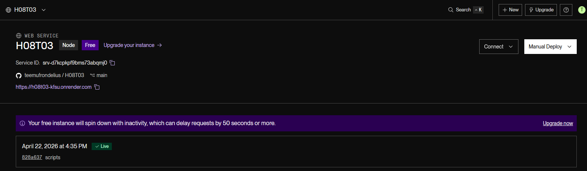
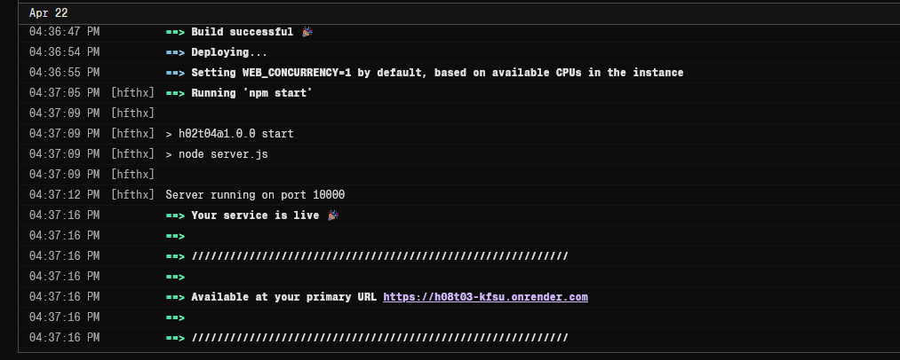
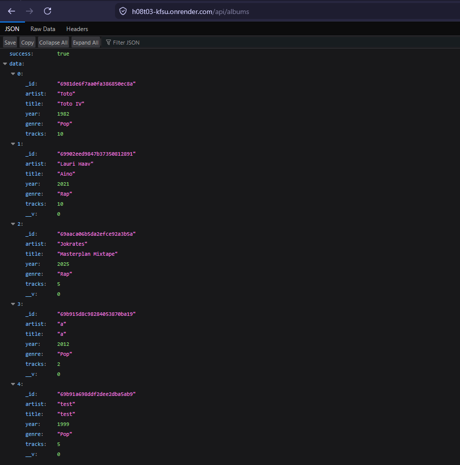

# Documentation for H08T03
Valitsin käyttää renderiä. Piti tehdä githubrepo, että pystyin yhdistämään renderiin joten tässä dokumentaatio prosessista. Toivottavasti tämä riittää :)

## Render setup

### New web service

#### Yhdistys GitHubiin

#### Komennot

#### Ympäsitömuuttujat, koska render ei näe .env tiedostoa, koska sitä ei ole githubissa.

### Deploying
Tässä oli aluksi ongelmia, mutta piti vain määritellä juuritiedosto. (kuva alla)

#### Logs
lopulta kaikki onnistui

#### Test

